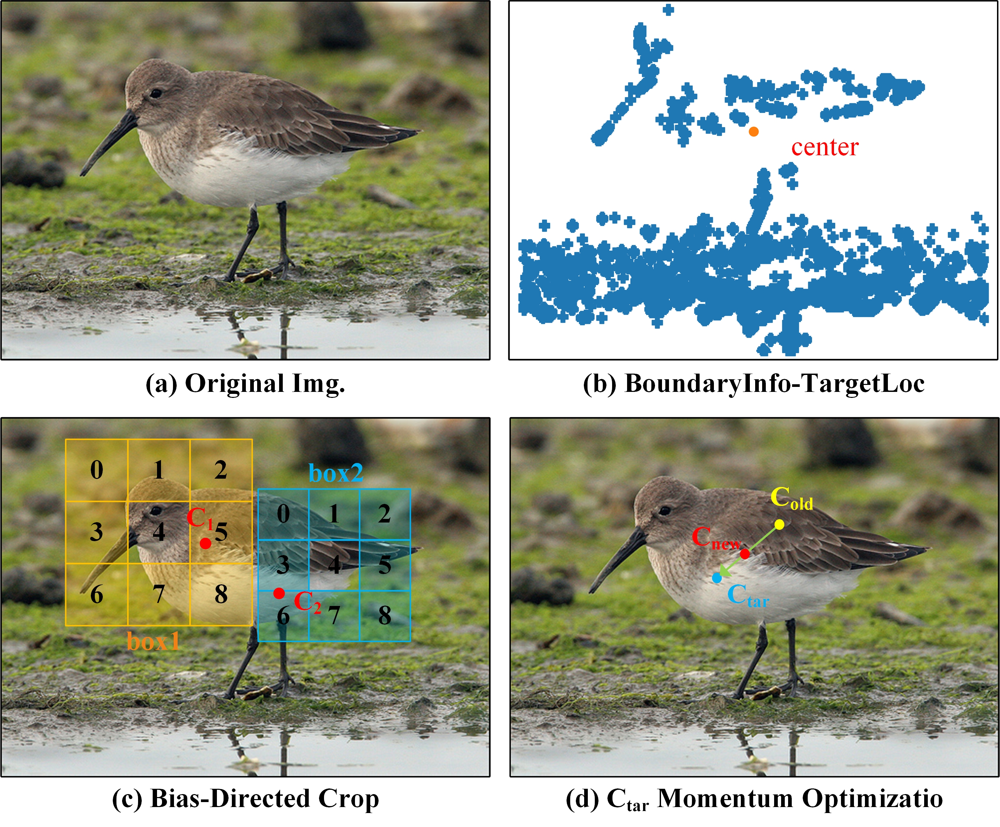

# Image Filtering-Based Positive Sample Pair Cropping for Contrastive Learning Optimization

[//]: # (![banner]&#40;&#41;)



[//]: # (![badge]&#40;&#41;)
[//]: # ([![license]&#40;https://img.shields.io/github/license/:user/:repo.svg&#41;]&#40;LICENSE&#41;)
[//]: # ([![standard-readme compliant]&#40;https://img.shields.io/badge/readme%20style-standard-brightgreen.svg?style=flat-square&#41;]&#40;https://github.com/RichardLitt/standard-readme&#41;)

This repo includes PyTorch implementation of SimCLR, MoCo, BYOL and SimSiam, as well as their FilteringCrop training code.

## Table of Contents

- [Preparation](#Preparation)
- [Usage](#usage)

[//]: # (- [Contributing]&#40;#contributing&#41;)


## Preparation

### Requirements

```
python >= 3.9.16
pytorch >= 2.0.0
numpy >= 1.23.5
diffdist >= 0.1
pillow >= 9.5.0
scipy >= 1.10.1
tqdm >= 4.65.0
```

### Datasets
Please download and organize the datasets in this structure:

```
├── datasets/
    ├── ImageNet/
    │   ├── train/ 
    │   ├── val/
    ├── cifar-10-batches-py/
    ├── cifar-100-python/
    ├── tiny-imagenet-200/
    │   ├── train/
    │   ├── val/
```

### Init Centers
When the code automatically retrieves the saved file of the initial target center, it will directly read the file. If the file is not found, it will re-obtain the target center and save it. The saved file is located in a subdirectory under the root directory of the dataset. The file structure is as follows:

```
├── datasets/
    ├── ImageNet/
    │   ├── train/ 
    │   ├── val/
    │   ├── center_ckp.pth
    ├── cifar-10-batches-py/
    │   ├── center_ckp.pth
    │   ├── ...
    ├── cifar-100-python/
    │   ├── center_ckp.pth
    │   ├── ...
    ├── tiny-imagenet-200/
    │   ├── train/
    │   ├── val/
    │   ├── center_ckp.pth
```


## Usage

```
python [model]_[type].py \       #
  --cfg=config \                 # path to training profile from ./cfg/
  --i=false                      # save log
```
### Change the Training Config File

path: ./cfg/moco/in1000_Fcrop.yml
```
in1000_Fcrop.yml:

...

# dataset
dataset:
  root: ../ILSVRC2012   # path to datasets

...
```
### Training Pre-trained Weights and Conducting Linear Evaluation
Run
```
python [model_type].py \            
--cfg=moco/in1000_Fcrop \               # path to training config from ./cfg/
--i=false                                        # save log
```
Optional Configurations
```
# ImageNet 1k
python moco_Fcrop_amp.py --cfg=moco/in1000_Fcrop --i=false               # mixed precision training (float16)
python moco_Fcrop.py --cfg=moco/in1000_Fcrop --i=false
```

### Resume Training

```
├── FilteringCrop/
    ├── ...
    ├── moco_in100_Fcrop_y-m-d_h               # log dir
    ├── ...


python moco_Fcrop_amp.py \
--cfg=moco/in1000_Fcrop \
--r=moco_in100_Fcrop_y-m-d_h \               # resume configure
--i=false
```

### Codes

The code related to the FilteringCrop is as follows: 
```
./build/util/F_Crop_util.py 
./build/datasets/transform/F_Crop.py
```

